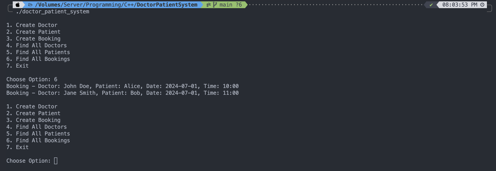

# Doctor-Patient Booking System

## Project Overview

The Doctor-Patient Booking System is a C++ project designed to manage appointments between doctors and patients. Doctors can create schedules, and patients can book appointments based on these schedules. This project demonstrates the use of Object-Oriented Programming (OOP) principles in C++ and file handling using CSV files.

## Output Screenshot



## Directory Structure

```
DoctorPatientSystem/
├── data/
│   ├── doctors.csv       # Stores doctor data
│   ├── patients.csv      # Stores patient data
│   └── bookings.csv      # Stores booking data
├── include/
│   ├── Booking.h         # Booking class header
│   ├── Doctor.h          # Doctor class header
│   ├── Patient.h         # Patient class header
│   └── Schedule.h        # Schedule class header
├── src/
│   ├── Booking.cpp       # Booking class implementation
│   ├── Doctor.cpp        # Doctor class implementation
│   ├── Patient.cpp       # Patient class implementation
│   ├── Schedule.cpp      # Schedule class implementation
│   └── main.cpp          # Main program file
├── LICENSE               # License file
├── Makefile              # Makefile for building the project
└── README.md             # Project documentation
```

## Goals

1. **Implement OOP Principles**: Demonstrate the use of classes, inheritance, and encapsulation in C++.
2. **File Handling**: Store and retrieve data using CSV files.
3. **Terminal Interface**: Provide a basic terminal interface for interacting with the system.
4. **Modularity**: Structure the project in a modular way, separating declarations and implementations.

## Classes

### 1. Doctor
- **Attributes**: Name, Specialization
- **Methods**: Getters, Load from CSV, Save to CSV

### 2. Patient
- **Attributes**: Name, Age, Ailment
- **Methods**: Getters, Load from CSV, Save to CSV

### 3. Schedule
- **Attributes**: Date, Time
- **Methods**: Getters

### 4. Booking
- **Attributes**: Doctor, Patient, Schedule
- **Methods**: Getters, Load from CSV, Save to CSV

## Setting Up the Project

### Prerequisites

- A C++ compiler (e.g., `g++`)
- `make` utility (optional but recommended for easier compilation)

### Steps

1. **Clone the Repository**

   ```sh
   git clone https://github.com/yourusername/DoctorPatientSystem.git
   cd DoctorPatientSystem
   ```

2. **Create CSV Files**

   Ensure the `data` directory contains the following CSV files:

   - `doctors.csv`
   - `patients.csv`
   - `bookings.csv`

   Example content for `doctors.csv`:

   ```
   John Doe,Cardiology
   Jane Smith,Neurology
   ```

   Example content for `patients.csv`:

   ```
   Alice,30,Flu
   Bob,45,Headache
   ```

   Example content for `bookings.csv`:

   ```
   John Doe,Alice,2024-07-01,10:00
   Jane Smith,Bob,2024-07-01,11:00
   ```

3. **Compile the Project**

   Use the `make` utility to compile the project:

   ```sh
   make
   ```

   If `make` is not installed, you can compile manually:

   ```sh
   g++ -std=c++17 -Iinclude src/*.cpp -o doctor_patient_system
   ```

4. **Run the Executable**

   ```sh
   ./doctor_patient_system
   ```

## Project Planning

### Phase 1: Define Classes and Methods

- **Doctor Class**: Define attributes and methods for managing doctor data.
- **Patient Class**: Define attributes and methods for managing patient data.
- **Schedule Class**: Define attributes and methods for managing schedule data.
- **Booking Class**: Define attributes and methods for managing booking data.

### Phase 2: Implement File Handling

- Implement methods for loading data from CSV files.
- Implement methods for saving data to CSV files.

### Phase 3: Create Terminal Interface

- Implement a basic terminal interface for adding and viewing doctors, patients, and bookings.

### Phase 4: Testing and Debugging

- Test each class and method to ensure they work correctly.
- Debug any issues that arise during testing.

## Usage

The terminal interface provides options to:

- Add a new doctor
- Add a new patient
- Add a new booking
- View all doctors
- View all patients
- View all bookings

## Example Terminal Commands

- **Add Doctor**: Prompts for name and specialization.
- **Add Patient**: Prompts for name, age, and ailment.
- **Add Booking**: Prompts for doctor name, patient name, date, and time.
- **View Doctors**: Displays a list of all doctors.
- **View Patients**: Displays a list of all patients.
- **View Bookings**: Displays a list of all bookings.

## Conclusion

This project provides a simple yet comprehensive example of how to use C++ for a real-world application involving file handling and OOP principles. By following the steps and understanding the project structure, students can learn to build similar systems and expand upon this basic framework.